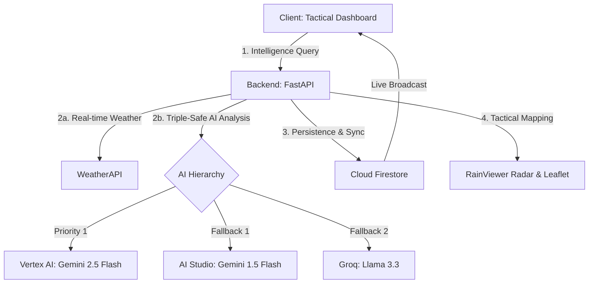

# Nature's Event: Guardian Platform
## Advanced Disaster Monitoring & Tactical Intelligence

An asynchronous, event-driven disaster monitoring platform designed for hyper-localized emergency guidance. This system orchestrates real-time meteorological telemetry, automated image triaging, and geospatial safe-zone mapping.

## 🏗️ System Architecture (Guardian Elite)

## 🌟 Technical Highlights

### 1. Triple-Safe AI Hierarchy
- **Credit-Prioritized Execution**: Operates primarily on **Vertex AI (Gemini 2.5 Flash)** to leverage GCP credits, with automated failover logic to AI Studio and Groq for 100% decision availability.
- **Multi-Modal Triage**: Uses Gemini's vision capabilities to parse unstructured disaster imagery, identifying hazards and proposing evacuation targets.

### 2. Layout Stability & Elite UX
- **Layout Stability Lock**: Enforces a fixed-viewport "Command Center" experience. Individual panels (VAI Chatbot, News, Metrics) use high-performance internal scrolling to prevent UI drift on laptop screens.
- **Glassmorphism 2.0**: Uses deep `backdrop-filter` effects, CyberScan radar animations, and JetBrains Mono typography for a premium look and feel.
- **Tactical Sidebars**: Sophisticated layout that retracts side panels into high-visibility "Tactical Drawers" on mobile and tablet devices.

### 3. Nature Intelligence & Memory
- **14-Day Tactical Memory**: Both Backend and Frontend maintain a high-density cache of disaster intelligence from the past two weeks, ensuring the dashboard is never empty.
- **Natural Event Filtering**: A keyword-driven engine (NADMA, Monsoon, Storm, Flood) that purges general news and focuses 100% on environmental hazards.
- **Strategic Deep-Linking**: Integrated "Deep-Link" technology that connects News Center headlines directly to official Bernama and GDACS article IDs.

### 4. Safety & Navigation
- **Live Weather Radar**: Integrated RainViewer tiles provide real-time precipitation overlays (10-minute intervals).
- **Civilian Safety Assets**: Sonar-pulse markers for Medical Hubs (Red), Shelters (Green), and Access/Blockages (Orange).
- **SafetyPath Navigation**: Dynamic polyline generation between user location and AI-identified safe-zone shelters.

## 🛠️ Stack
- **Frontend**: React 19, Vite, React-Leaflet, Framer Motion, Firebase SDK.
- **Backend**: Python 3.12, FastAPI, Google GenAI SDK (Vertex AI), Firebase Admin.
- **Intelligence**: Bernama RSS, GDACS RSS, RainViewer API.
- **Cloud**: Google Cloud Platform (Vertex AI, Cloud Run), Firebase (Firestore, Auth).
- **Infrastructure**: Vercel (Frontend), Render/GCP (Backend).

## 💡 How It Works
1. **Detection**: Upon incident reporting (image upload or manual map pin), the backend calculates hazard logic and severity.
2. **Analysis**: Gemini 2.5 parses the context, fetches live weather telemetry, and drafts a tactical response.
3. **Broadcast**: The report is saved to Firestore and instantly synced to the dashboards of all users within the affected region.
