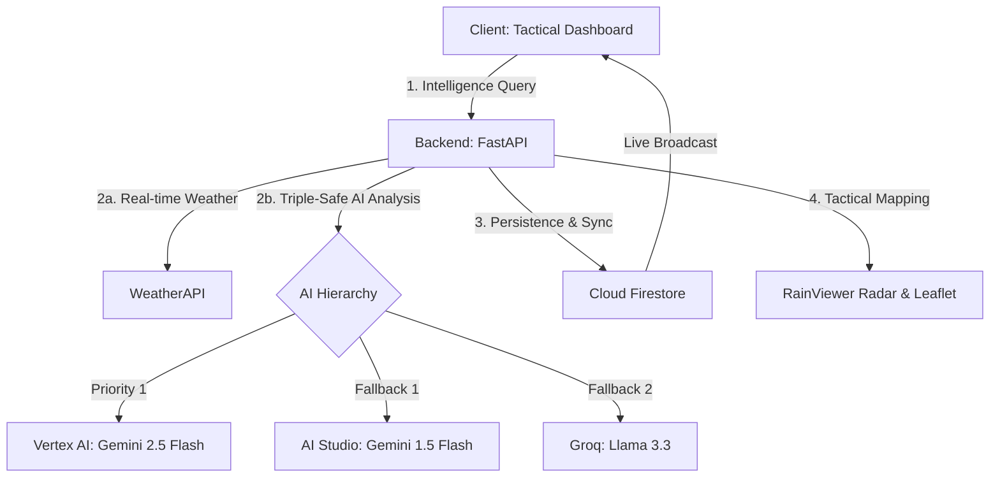

# Nature's Event: Guardian Platform
## Advanced Disaster Monitoring & Tactical Intelligence

An asynchronous, event-driven disaster monitoring platform designed for hyper-localized emergency guidance. This system orchestrates real-time meteorological telemetry, automated image triaging, and geospatial safe-zone mapping.

## 🏗️ System Architecture (Guardian Upgrade)

## 🌟 Technical Highlights

### 1. Triple-Safe AI Hierarchy
- **Credit-Prioritized Execution**: Operates primarily on **Vertex AI (Gemini 2.5 Flash)** to leverage GCP credits, with automated failover logic to AI Studio and Groq for 100% decision availability.
- **Multi-Modal Triage**: Uses Gemini's vision capabilities to parse unstructured disaster imagery, identifying hazards and proposing evacuation targets.

### 2. Guardian Real-Time Sync
- **Event-Driven Database**: Powered by **Cloud Firestore**, the platform streams community-reported incidents in real-time, instantly updating markers across all active dashboards.
- **Community Tactical Sensor**: Users can drop precise incident pins (Flood, Fire, Medical) directly on the map, which are broadcasted globally.

### 3. Tactical UI/UX Design System (Elite Mode)
- **Responsive Drawers**: A sophisticated layout that retracts side panels into high-visibility "Tactical Drawers" on mobile and tablet devices (1024px breakpoints).
- **Glassmorphism 2.0**: Uses deep `backdrop-filter` effects, CyberScan radar animations, and JetBrains Mono typography for a premium "Command Center" aesthetic.
- **Vibrant Dual-Theme**: Context-aware color tokens that maintain data vibrancy in both High-Contrast Dark and Sunlight-Readable Light modes.

### 4. Safety & Navigation
- **Live Weather Radar**: Integrated RainViewer tiles provide real-time precipitation overlays (10-minute intervals).
- **SafetyPath Navigation**: Dynamic polyline generation between user location and AI-identified safe-zone shelters.

## 🛠️ Stack
- **Frontend**: React 19, Vite, React-Leaflet, Framer Motion, Firebase SDK.
- **Backend**: Python 3.12, FastAPI, Google GenAI SDK (Vertex AI), Firebase Admin.
- **Cloud**: Google Cloud Platform (Vertex AI, Billing Project), Firebase (Firestore, Auth).
- **Infrastructure**: Vercel (Frontend), Render (Backend).

## 💡 How It Works
1. **Detection**: Upon incident reporting (image upload or manual map pin), the backend calculates hazard logic and severity.
2. **Analysis**: Gemini 2.5 parses the context, fetches live weather telemetry, and drafts a tactical response.
3. **Broadcast**: The report is saved to Firestore and instantly synced to the dashboards of all users within the affected region.
Firebase Cloud Messaging**.
