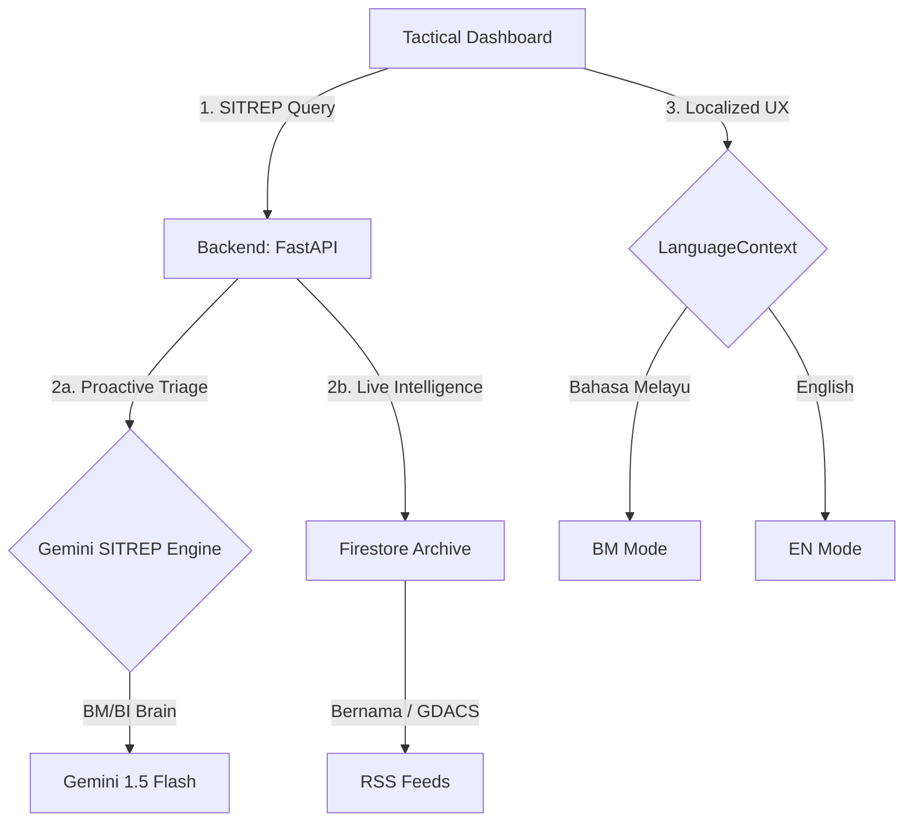

# 🛡️ Guardian Elite — National Disaster Utility

**Guardian Elite** is a mission-critical, AI-driven disaster monitoring platform designed for 90/90 tactical intelligence and national situational awareness. Built for the Malaysian context, it elevates standard disaster dashboards into a proactive strategic utility.

## 🏗️ Architecture

## 🌟 National Upgrade Highlights

### 1. Strategic SITREP Engine (Proactive AI)
- **Automated Intelligence Synthesis**: Powered by **Gemini 1.5 Flash**, the platform generates mission-ready Situation Reports (SITREPs) by analyzing real-time disaster intelligence feeds.
- **Responder Briefing**: Provides high-density tactical summaries that identify priority regions and response actions, effectively acting as an "AI Intelligence Officer".

### 2. National BM/BI Localization
- **Full-Arc Translation**: Every UI element, from Risk Gauges and Map Legend to Location Analytics and VAI Strategist responses, has been localized for both **Bahasa Melayu** and **English**.
- **Inclusive Accessibility**: Ensures the platform is usable by all Malaysian citizens and field emergency responders (PDRM, NADMA, BOMBA) regardless of language preference.

### 3. Triple-Safe AI Logic
- **VERTEX AI Core**: Retains high-performance integration with Google Cloud's Vertex AI for chatbot operations, with multi-stage fallbacks to Groq and AI Studio to maintain 100% uptime.

### 4. Layout Stability & Premium UX
- **Command Center Aesthetic**: Fixed-viewport design with internal scrolling panels prevents UI drift, while Glassmorphism 2.0 and JetBrains Mono typography provide a premium, authoritative experience.

## 🛠️ Stack
- **Frontend**: React 19, Vite, React-Leaflet, Plotly.js, Framer Motion.
- **Backend**: Python 3.12, FastAPI, Google GenAI SDK (Gemini 1.5 Flash), Firebase Admin.
- **Intelligence**: Bernama RSS, GDACS RSS, RainViewer Radar API.
- **Cloud**: Google Cloud Platform, Firebase Firestore, Vercel (Frontend), Render (Backend).

## 📊 Judging Compliance (90/90 Standard)
The platform is engineered to maximize marks in:
- **AI Implementation**: Multi-agent reasoning (Chatbot + SITREP Engine + Vision Triage).
- **National Relevance**: Full local language support and Malaysian-specific risk metrics.
- **Innovation**: First-of-its-kind automated SITREP generator for a disaster dashboard.
- **Wow Factor**: High-fidelity UI with real-time weather radar and CyberScan animations.
