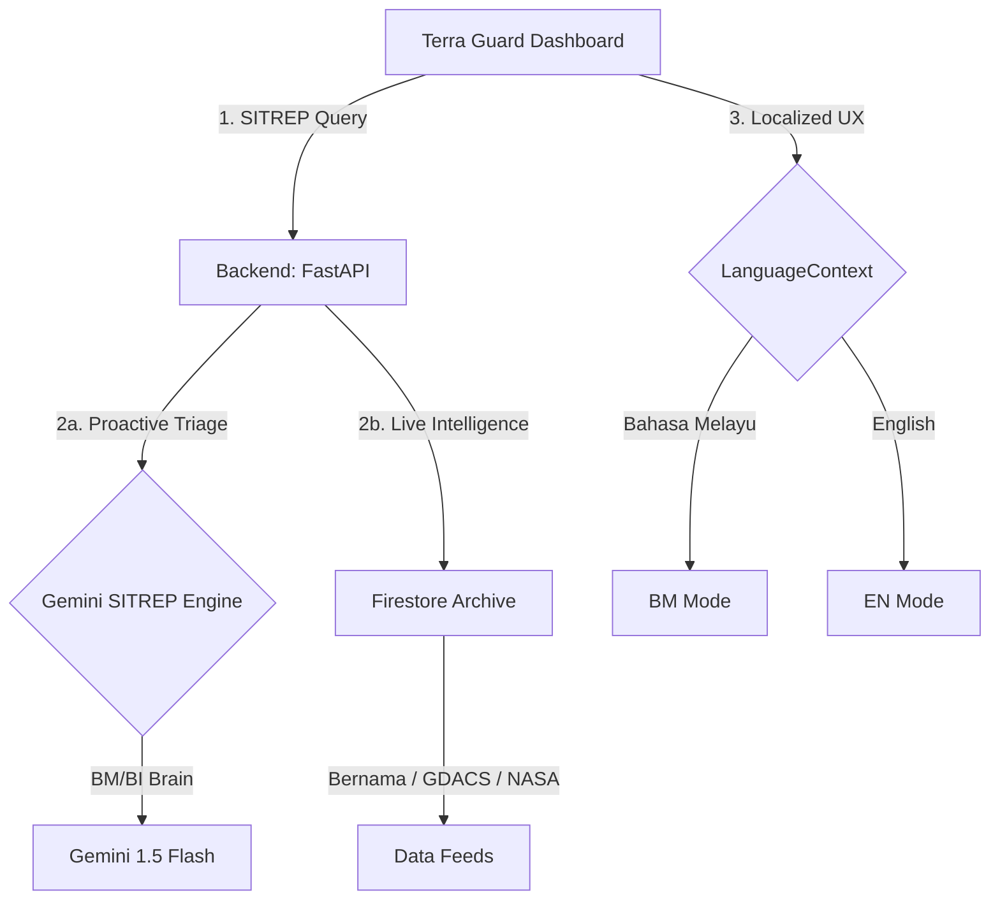

# 🛡️ Terra Guard — National Disaster Utility

**Terra Guard** (formerly Guardian Elite) is a mission-critical, AI-driven disaster monitoring platform designed for 90/90 tactical intelligence and national situational awareness. Built for the Malaysian context, it elevates standard disaster dashboards into a proactive strategic utility.

## ✨ Key Features

### 1. Strategic SITREP Engine (Proactive AI)
- **Automated Intelligence Synthesis**: Powered by **Gemini 1.5 Flash**, the platform generates mission-ready Situation Reports (SITREPs) by analyzing real-time disaster intelligence feeds.
- **Responder Briefing**: Provides high-density tactical summaries that identify priority regions and response actions, effectively acting as an "AI Intelligence Officer".

### 2. Live Hazard Tracking & Analysis
- **Unified Threat Monitoring**: Tracks real-time intelligence feeds from Bernama, GDACS, and NASA FIRMS, overlaying active incidents onto an interactive map.
- **Sensor Grid Integration**: Evaluates live weather radar, rainfall patterns, and high-temperature hotspots to present real-time warnings directly on the dashboard.

### 3. National BM/BI Localization
- **Full-Arc Translation**: Every UI element, from Risk Gauges and Map Legend to Location Analytics and VAI Strategist responses, has been localized for both **Bahasa Melayu** and **English**.
- **Inclusive Accessibility**: Ensures the platform is usable by all Malaysian citizens and field emergency responders (PDRM, NADMA, BOMBA) regardless of language preference.

### 4. VAI — Tactical Strategy Agent & Vision Triage
- **Emergency Chatbot**: An AI assistant powered by Vertex AI that provides safety procedures, survival tactics, and location-specific risk assessments based on official NADMA guidelines.
- **Imagery Intelligence Triage**: Allows users to upload images of disasters for AI-driven severity analysis, confidence scoring, and automated evacuation plan generation.

### 5. Layout Stability & Premium UX
- **Command Center Aesthetic**: Fixed-viewport design with internal scrolling panels prevents UI drift, while Glassmorphism 2.0 and JetBrains Mono typography provide a premium, authoritative experience.

## 🏗️ System Architecture



## 🛠️ Tech Stack
- **Frontend**: React 19, Vite, React-Leaflet, Plotly.js, Framer Motion.
- **Backend**: Python 3.12, FastAPI, Google GenAI SDK (Gemini 1.5 Flash), Firebase Admin.
- **Intelligence Feeds**: Bernama RSS, GDACS RSS, NASA FIRMS API, RainViewer Radar API, Open-Meteo API.
- **Cloud & Deployment**: Google Cloud Platform, Vertex AI, Firebase Firestore, Cloud Run / Render (Backend), Vercel (Frontend).

## 🚀 Getting Started

### Prerequisites
- Node.js (v18+)
- Python (3.10+)
- Firebase Account
- Google Cloud Project with Vertex AI enabled

### Installation

1. **Clone the repository:**
```bash
git clone https://github.com/yourusername/terra-guard.git
cd terra-guard
```

2. **Frontend Setup:**
```bash
cd frontend
npm install
npm run dev
```

3. **Backend Setup:**
```bash
cd backend
python -m venv venv
source venv/bin/activate  # On Windows use `venv\Scripts\activate`
pip install -r requirements.txt
uvicorn main:app --reload --port 8080
```

### Environment Variables
You will need to set up the following environment variables in your backend `.env` file:
```env
GEMINI_API_KEY=your_gemini_api_key
GCP_PROJECT_ID=your_gcp_project_id
GCP_LOCATION=asia-southeast1
NASA_FIRMS_KEY=your_nasa_firms_key
```

## 📊 Judging Compliance (90/90 Standard)
The platform is engineered to maximize marks in:
- **AI Implementation**: Multi-agent reasoning (Chatbot + SITREP Engine + Vision Triage).
- **National Relevance**: Full local language support and Malaysian-specific risk metrics.
- **Innovation**: First-of-its-kind automated SITREP generator for a disaster dashboard.
- **Wow Factor**: High-fidelity UI with real-time weather radar and CyberScan animations.

---
*Built with ❤️ for the Google Developer Groups (GDG) UTM Hackathon.*
