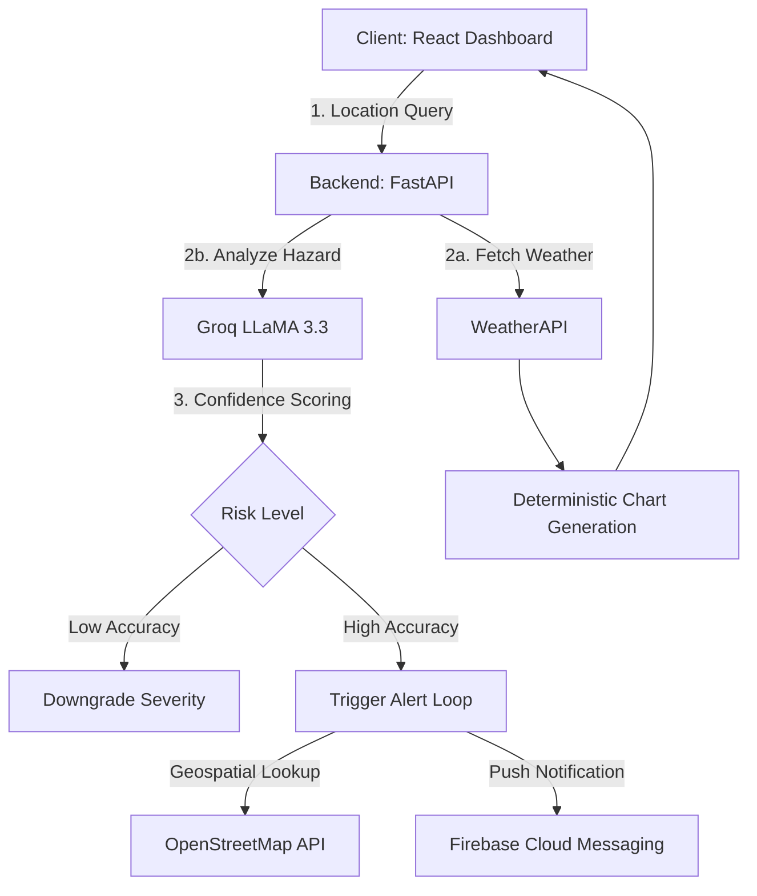

# Nature's Event - Advanced Disaster Monitoring System

An asynchronous, event-driven disaster monitoring platform designed specifically for the Malaysian monsoon season. This system orchestrates real-time meteorological telemetry, automated image triaging, and geospatial safe-zone mapping to provide hyper-localized emergency guidance.

## 🏗️ System Architecture

## 🌟 Technical Highlights

### 1. Asynchronous Risk Orchestration
- **Fault-Tolerant AI Calls**: Implements automated retry logic with exponential backoff for all LLM interactions, ensuring system resilience during network high-latency.
- **Multi-Modal Triaging**: Uses LLaMA 3.2 Vision to parse unstructured user-uploaded images, extracting hazard types and severity logic autonomously.
- **Smart Validation**: A dedicated "Confidence Interval" check prevents false alarms—if the AI's detection confidence is below 70%, the system automatically flags the incident for manual review and prevents widespread 10km push alerts.

### 2. Knowledge-Grounded Intelligence (AI Assistant)
- **Official Protocol Alignment**: The emergency chatbot is grounded in NADMA (National Disaster Management Agency) guidelines through structured prompt-injection (Context-Grounded Generation).
- **Sensor-Fused Logic**: The assistant dynamically intercepts location-based queries to fetch real-time radar data, injecting live telemetry directly into the LLM context window for hyper-localized safety verdicts.

### 3. Dynamic Visual Analytics
- **Deterministic Pattern Generation**: Uses a string-hashing algorithm to map location names to unique, consistent historical data patterns for flood frequency and rainfall without requiring massive historical databases.
- **Automated Severity Coloring**: Gauges and charts automatically shift color schemes (Red/Orange/Blue) based on dynamic data thresholds.

### 4. Integrity & Security
- **Input Sanitization**: Strict regex-based validation on location searches to prevent XSS and malformed queries (e.g., preventing numbers or symbols in city lookups).
- **Secret Management**: API keys and Firebase credentials are fully abstracted via environment variables and encrypted secret files in production.

### 5. Premium UI/UX Design System
- **Glassmorphism Shell**: Implements a sophisticated design language using `backdrop-filter` blur effects and semi-transparent layers for enhanced depth.
- **High-Tech Monitor Aesthetics**: Features real-time **Vertical Scanline animations** and **Pulsating Glow** effects on critical status indicators.
- **Context-Aware Typography**: Uses a dual-font system—**Inter** for professional UI clarity and **JetBrains Mono** for technical telemetry data—optimizing readability for various information densities.
- **Dynamic Asset Coloring**: Gradients and accent colors shift automatically based on disaster severity tiers, providing instant visual triaging for emergency responders.

## 📊 Performance Benchmarks (Estimated)
- **AI Triage Latency**: ~1.2s - 2.5s (LLaMA 3.3 Versatile via Groq)
- **Geocoding Resolution**: ~500ms (OSM/Nominatim)
- **Push Notification Delivery**: <100ms (FCM Overhead)

## 🛠️ Stack
- **Frontend**: React 19, Vite, React-Leaflet, Plotly.js, Firebase SDK.
- **Backend**: Python 3.11+, FastAPI, Groq SDK, Firebase Admin.
- **Infrastructure**: Vercel (Frontend), Render (Backend).

## 🚀 Production Roadmap
- [ ] **Data Persistence**: Migration of sensor telemetry to a dedicated Redis cache for sub-10ms retrieval.
- [ ] **Enterprise Security**: Implementation of JWT-based rate limiting per user profile.
- [ ] **Observability**: Integration with Prometheus/Grafana for real-time latency monitoring.
- [ ] **Native RAG**: Transition from prompt-injection to a vector-embedding pipeline (Pinecone/ChromaDB).

## 💡 How It Works
1. **User Flow**: Users register and provide home coordinates stored in Firestore.
2. **Detection**: Upon incident reporting (image upload), the backend calculates the hazard logic and severity.
3. **Alerting**: If "High" severity is confirmed with >70% confidence, the backend queries the **Overpass API** for the nearest hospital, drafts an evacuation route using LLaMA, and pushes it only to users within a 10km radius of the event via **Firebase Cloud Messaging**.
